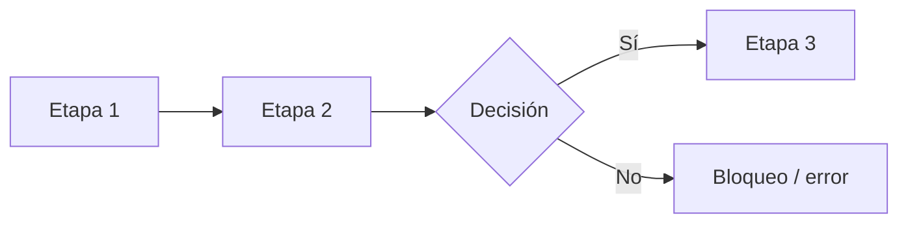

<!--
PLANTILLA DE DOCUMENTO DE PROCESO / AUTOMATIZACIÓN — SL Logística
Cómo usarla:
  1) Copia este archivo a docs/procesos/<nombre-del-proceso>.md
  2) Borra estos comentarios y rellena cada sección.
  3) Quita las secciones que no apliquen (pero conserva el orden).
Convenciones:
  - Tablas para metadatos, roles y estados.
  - Callouts: > [!warning] (problema/causa), > [!danger] (punto técnico crítico),
    > [!important] (regla de negocio), > [!note] (notas/alternativas).
  - Si toca SAP, deja SIEMPRE clara la separación: ¿qué impacta SAP y qué no?
    (SAP es mono-empresa: en consolidados, dividir por empresa — ver CLAUDE.md).
-->

# <Título del proceso>
**Documento de proceso y diagrama de flujo** — Desde <punto de inicio> hasta <punto final / impacto en SAP>.

| Campo | Detalle |
|---|---|
| **Objetivo** | <qué problema elimina / qué automatiza> |
| **Alcance** | <qué cubre y qué NO cubre> |
| **Sistema destino** | <SAP Business One (Service Layer) / otro> |
| **Versión** | 1.0 — borrador para revisión |
| **Estado** | <borrador / en revisión / aprobado> |
| **Autor / fecha** | <nombre · fecha> |

---

## 1. Contexto y problema actual
**Situación hoy.** <cómo se hace hoy>
**Problema.** <qué falla y su impacto>

> [!warning] Causa raíz
> <por qué ocurre el problema de fondo>

## 2. Objetivos de la automatización
- <objetivo 1>
- <objetivo 2>

## 3. Roles involucrados

| Rol | Responsabilidad en el proceso |
|---|---|
| **<rol>** | <qué hace> |

## 4. Diagrama de flujo del proceso
<resumen en N etapas. Usa un diagrama mermaid (se renderiza en GitHub/Obsidian):>

## 5. Descripción detallada por etapa

### Etapa 1 — <nombre>
<detalle paso a paso. Resultado de la etapa.>

> [!danger] Punto técnico crítico
> <la pieza que más define la implementación; opciones técnicas; qué falta confirmar>

> [!important] Regla de negocio
> <reglas que NO se pueden romper, p. ej. "nada fuera de tolerancia impacta SAP">

## 6. Estados del registro
<si el proceso tiene un ciclo de estados, descríbelos y marca cuáles impactan SAP.>

| Estado | ¿Qué significa? | ¿Impacta SAP? |
|---|---|:---:|
| **<ESTADO>** | <significado> | No / Sí |

## 7. Decisiones y dudas pendientes

| # | Tema | Pregunta a resolver |
|:--:|---|---|
| 1 | <tema> | <pregunta a definir con el equipo> |

## 8. Próximos pasos sugeridos
1. <siguiente acción>
2. <siguiente acción>
