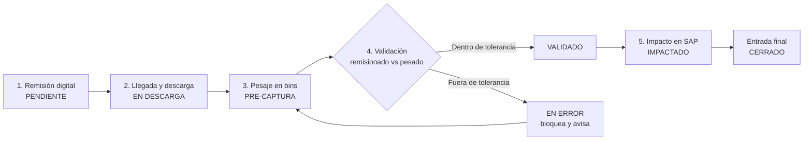

# Automatización del Recibo y Pesaje de Materia Prima
**Documento de proceso y diagrama de flujo** — Desde la remisión digital hasta el impacto en SAP Business One.

| Campo | Detalle |
|---|---|
| **Objetivo** | Eliminar la captura manual (libreta → Excel → SAP) y los errores que provoca. |
| **Alcance** | Recibo, descarga, pesaje en bins, validación y entrada a producción. |
| **Sistema destino** | SAP Business One (integración vía Service Layer). |
| **Versión** | 1.0 — borrador para revisión. |
| **Estado** | Pendiente de validar decisiones marcadas (§7). |
| **Autor / fecha** | _(pendiente)_ |

---

## 1. Contexto y problema actual

**Situación hoy.** Los camiones llegan al área de recibo. Cuando se descargan, el dato se anota en una libreta y posteriormente se vuelve a capturar en Excel. Esa doble captura manual es la que finalmente alimenta SAP.

**Problema.** Al ser un proceso manual y repetido, es propenso a errores. Recientemente se capturó un dato equivocado y se subió de más a SAP, lo que obliga a correcciones posteriores y resta confianza al inventario.

El proceso inicia a partir de una remisión que el proveedor envía por WhatsApp, y termina cuando el material pesado se carga a la orden de producción correspondiente en SAP.

> [!warning] Causa raíz
> El dato se transcribe varias veces (báscula → libreta → Excel → SAP) sin ninguna validación automática entre lo remisionado y lo realmente pesado. El error solo se detecta cuando **ya impactó SAP**.

## 2. Objetivos de la automatización

- Capturar el peso **directamente desde la báscula**, con un solo clic, eliminando la libreta y el Excel intermedio.
- Tener la **remisión cargada antes de que llegue el camión**, dejándola como "pendiente".
- **Validar automáticamente** lo remisionado contra lo pesado, con un margen de tolerancia configurable.
- **Impedir que un dato fuera de tolerancia llegue a SAP**: el sistema bloquea y avisa antes de impactar.
- **Separar el registro operativo** (pre-captura) **del impacto contable en SAP**, que requiere revisión y entrada final.
- Impactar la **orden de producción correcta** en SAP filtrando por lote, proyecto, empresa y tipo (orgánico/inorgánico).

## 3. Roles involucrados

| Rol | Responsabilidad en el proceso |
|---|---|
| **Proveedor** | Genera y envía la remisión digital del material que despacha. |
| **Operador de báscula / montacargas** | Coloca cada bin en la báscula y ejecuta la captura de peso. |
| **Sistema (software a desarrollar)** | Recibe remisiones, captura pesos, valida tolerancia y comunica con SAP. |
| **Encargado de recibo** | Revisa la conciliación remisionado vs pesado y da la entrada final. |
| **SAP Business One** | Recibe el impacto en la orden de producción vía Service Layer. |

## 4. Diagrama de flujo del proceso

El flujo completo en cinco etapas (detalle en §5):

## 5. Descripción detallada por etapa

### Etapa 1 — Remisión digital
Hoy la remisión llega por WhatsApp. La propuesta es convertirla en una **remisión digital estructurada** registrada en el sistema. Dos caminos posibles (decisión pendiente, §7):
- **Opción A — Bot lector de WhatsApp:** un bot recibe el mensaje del proveedor y extrae los datos (por OCR si es imagen/PDF, o leyendo el texto). No cambia el hábito del proveedor.
- **Opción B — Portal del proveedor:** el proveedor captura la remisión en un formulario web. El dato entra limpio y estructurado, sin OCR.

**Resultado:** la remisión queda registrada con material, cantidad esperada, lote/proyecto y datos del proveedor.

### Etapa 2 — Llegada del camión y descarga
- La remisión ya está en el sistema con estado **PENDIENTE**.
- Al llegar el camión, el encargado lo **asocia a su remisión pendiente** y marca el inicio de la descarga.
- A partir de aquí, el sistema sabe qué se espera recibir y contra qué comparar.

### Etapa 3 — Pesaje en bins (pre-captura)
El material se pesa en bins. Por cada bin:
1. El montacargas baja el bin y lo coloca sobre la báscula.
2. La báscula muestra el peso (está conectada al sistema).
3. El operador da clic en **"Capturar peso"** y el valor se registra automáticamente.
4. **Pre-captura:** el peso queda registrado pero **aún no impacta SAP**.
5. Si hay más bins, se repite el ciclo; el sistema acumula el total pesado.

> [!danger] Punto técnico crítico — conexión de la báscula
> Es la pieza que más define la implementación. Cómo "capturar peso con un clic" depende del tipo de salida del indicador:
> - **Serial RS-232 / USB:** un servicio lee la trama del puerto y la entrega al sistema.
> - **Ethernet / TCP-IP:** el indicador expone el peso en red y el sistema lo consulta.
> - **Indicador con API propia:** se integra directamente contra esa API.
>
> **Pendiente:** confirmar marca, modelo y tipo de salida de la báscula (§7).

### Etapa 4 — Validación: remisionado vs pesado
Antes de cualquier impacto en SAP, el sistema compara lo remisionado contra el total pesado:
- **Dentro de tolerancia:** la pre-captura queda lista para impactar SAP.
- **Fuera de tolerancia:** el sistema arroja error, **bloquea el avance** y notifica para reconteo o corrección.

El margen de tolerancia debe ser **configurable** (porcentaje o valor fijo en kg) y puede variar según el tipo de material.

> [!important] Regla de negocio
> Ningún registro fuera del margen de tolerancia puede impactar SAP. El bloqueo es **automático** y ocurre **ANTES** del impacto — justo lo que evita el problema actual de "subir de más".

### Etapa 5 — Impacto en SAP y entrada final
Una vez validada la tolerancia, el sistema impacta SAP Business One vía **Service Layer**:
- **Orden de producción:** se impacta filtrada por lote, proyecto, empresa y tipo (orgánico/inorgánico), y tabla de ser necesario.
- **Entrada final:** el encargado revisa la producción ya cuadrada y da la entrada final en el sistema. Último control humano antes de cerrar.

Con esto, el dato que llega a SAP ya pasó por **captura automática desde la báscula + validación de tolerancia + revisión del encargado**.

## 6. Estados del registro

| Estado | ¿Qué significa? | ¿Impacta SAP? |
|---|---|:---:|
| **PENDIENTE** | Remisión cargada, esperando al camión. | No |
| **EN DESCARGA** | Camión asociado, pesaje en curso. | No |
| **PRE-CAPTURA** | Pesos registrados, sin validar/impactar. | No |
| **EN ERROR** | Fuera de tolerancia, bloqueado. | No |
| **VALIDADO** | Dentro de tolerancia, listo para SAP. | No |
| **IMPACTADO** | Cargado a la orden de producción en SAP. | **Sí** |
| **CERRADO** | Entrada final dada por el encargado. | **Sí** |

## 7. Decisiones y dudas pendientes

| # | Tema | Pregunta a resolver |
|:--:|---|---|
| 1 | **Báscula** | ¿Marca, modelo y tipo de salida (serial, Ethernet, API)? Define cómo se captura el peso. |
| 2 | **Bins y tara** | ¿Se pesa bin por bin y se suman? ¿La tara del bin se descuenta automáticamente? |
| 3 | **Remisión** | ¿Bot lector de WhatsApp (Opción A) o portal del proveedor (Opción B)? |
| 4 | **Tolerancia** | ¿El margen es porcentaje o valor fijo? ¿Varía por tipo de material? |
| 5 | **SAP** | Confirmar objeto exacto a impactar y campos de filtrado (lote, proyecto, empresa, orgánico/inorgánico). |
| 6 | **Entrada final** | ¿La entrada final del encargado es dentro del sistema, o el encargado empuja manualmente a SAP? |

> [!note] Nota sobre la remisión por WhatsApp
> El **bot lector** (A) es más cómodo para el proveedor (no cambia su hábito) pero depende de OCR y la calidad del mensaje, lo que puede reintroducir errores. El **portal** (B) es más confiable porque el dato entra estructurado, pero requiere que el proveedor capture. Ruta intermedia: empezar con el bot y migrar a portal con los proveedores recurrentes.

## 8. Próximos pasos sugeridos

1. Validar las decisiones de §7 (especialmente **báscula** y **remisión**).
2. Con la báscula confirmada, hacer una **prueba de concepto** de captura de peso en clic.
3. Definir la **tolerancia** con el área de calidad/producción.
4. Diseñar las **pantallas** (remisiones pendientes, pesaje, validación, entrada final).
5. Especificar la **integración con Service Layer** y el objeto SAP a impactar.
6. **Pilotar** con un proveedor y un tipo de material antes de extender a todos.

Cuando se definan las decisiones pendientes, el siguiente entregable natural es el **boceto de pantallas (mockups)** y el **documento técnico de integración con Service Layer**.
